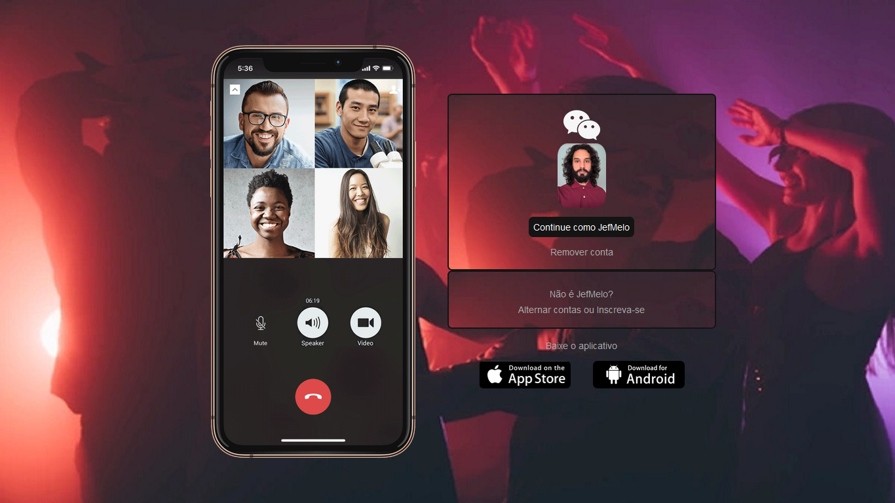

# Página inicial do Wechat

Olá! Projeto baseado na página de login do [wechat](https://www.wechat.com/pt/) e usando as referencias da aula Recriando a página inicial do Instagram. Os botões das lojas de app funcionam corretamente, redirecionando para respectiva loja.

## Os requisitos são

* [HTML básico](https://www.w3schools.com/html/)
* [CSS básico](https://developer.mozilla.org/pt-BR/docs/Web/CSS)

## Print Exemplo

