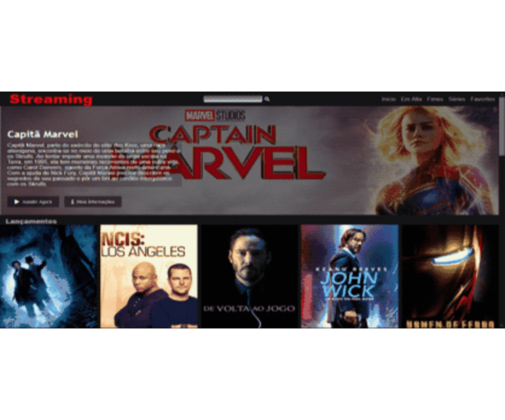

# Recriando a Interface do Netflix

>Olá! O projeto do site Streaming criado com base no Netflix clone. Carrossel com loop infinito automático na home-pege, botões de play e info para cada poster, nas pages favoritos, lançamentos e etc, os botões foram removidos e o play se dá ao clicar no poster e passando o mouse se tem a sinopse bem como a classificação, e o carrossel está com loop manual.

