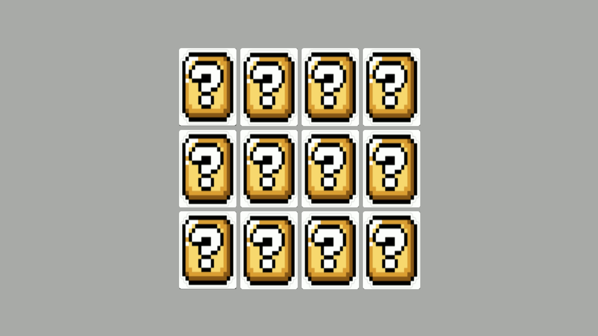

# JOGO DA MEMÓRIA

Nesse projeto, o desafio é criar um jogo da memória utilizando apenas HTML, CSS e Javascript. Com poucas linhas de código, trabalhando com efeitos 3D no CSS e lógica de programação utilizando condicionais, Immediately Invoked Function Expression e manipulação de Array em um projeto super divertido.  

## Os requisitos são

* [HTML básico](https://www.w3schools.com/html/)
* [CSS básico](https://developer.mozilla.org/pt-BR/docs/Web/CSS)
* [Javascript básico](https://developer.mozilla.org/pt-BR/docs/Web/JavaScript)  

## Jogando

